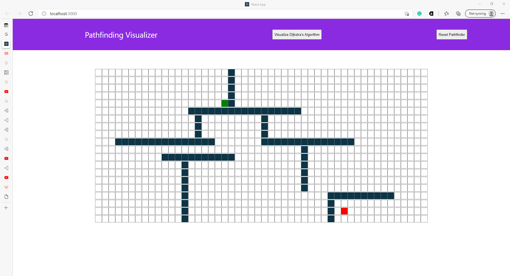

# Pathfinding Algorithm Visualizer
## Map


## Result


## Table of contents
* [General info](#general-info)
* [Technologies](#technologies)
* [Launch](#launch)

## General info
This project was bootstrapped with [Create React App](https://github.com/facebook/create-react-app).
	
## Technologies
Project is created with:
* JavaScript
* React
* CSS
* Npm
	
## Launch

In the project directory, you can run in a terminal :

```
$ npm start
```

Runs the app in the development mode.\
Open [http://localhost:3000](http://localhost:3000) to view it in the browser.